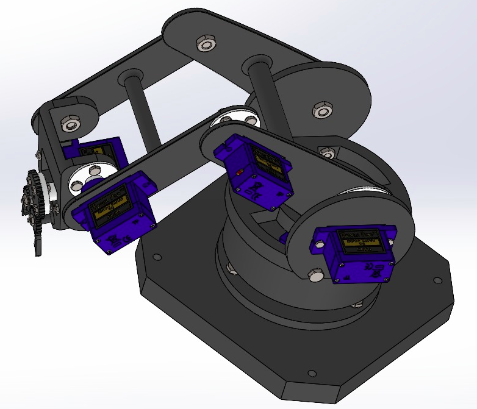

# Projects at NTU MAE Robotics Club

* Part of an NTU MAERC initiative

## Advanced Group 1

* Repository for Advanced Group 2 to build code!

# Robotic Arm to sort Cutlery

## Robotic Arm Details

* Robotic arm used is a 4 DOF robotic arm, with a base that is capable of yaw motion and the other 3 DOF's are planar.


## Steps to launch Robotic arm in Rviz and Gazebo

### Some required changes  

In line 109 and 130 of the myworld.world file in robotic_arm_description/worlds, change the path of the mesh file to the path of the file on ur machine.

### Run the simulation  

```shell
roslaunch moveit_resources demo_gazebo.launch
```  

  Now u can plan and execute from rviz using the moveit plugin and see the arm moving in gazebo.  
  U can change the position and orientation of the fork in the world, u can move it around using the rotation and translation tools, but this change is not permanent.
  
To change the fork position permanently,  

```shell
roslaunch moveit_resources customw.launch
```

Now change the position or u can even add more forks/spoons using the model editor tool and save the world in robotic_arm_description/worlds/myworld.world.  
To change the size of the fork, change the scale parameter in line 110 and line 131 of myworld.world file.

## Steps to run the IK-Solver for the Robotic arm

Working on a fix to an error which does not recognise the move_group

```shell
rosrun robotic_arm_kinematics ik_exec
```


### Steps to clone the repository

* Launch a terminal and run the command  

```shell
git clone https://github.com/ntu-maerc/a1.git 
```
